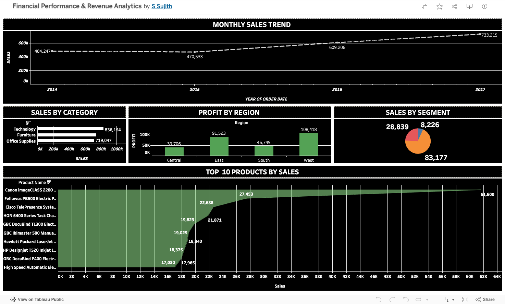
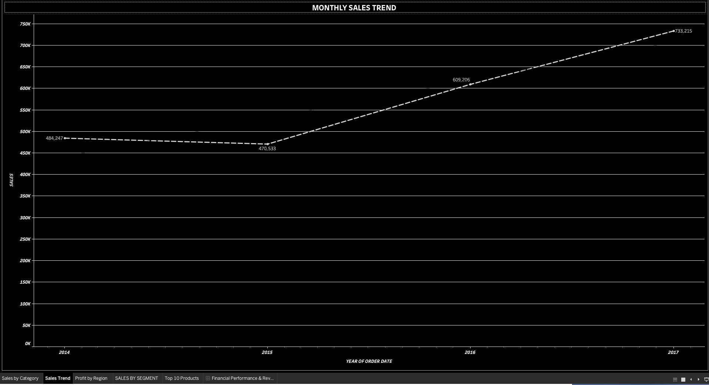
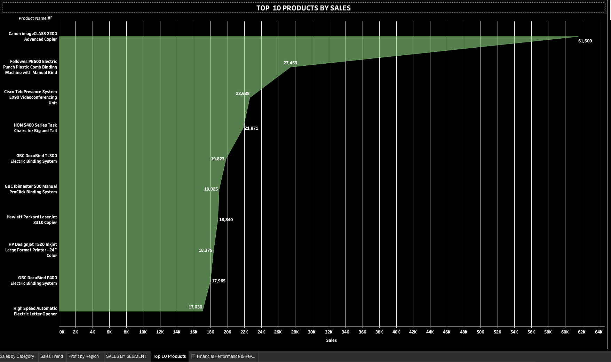
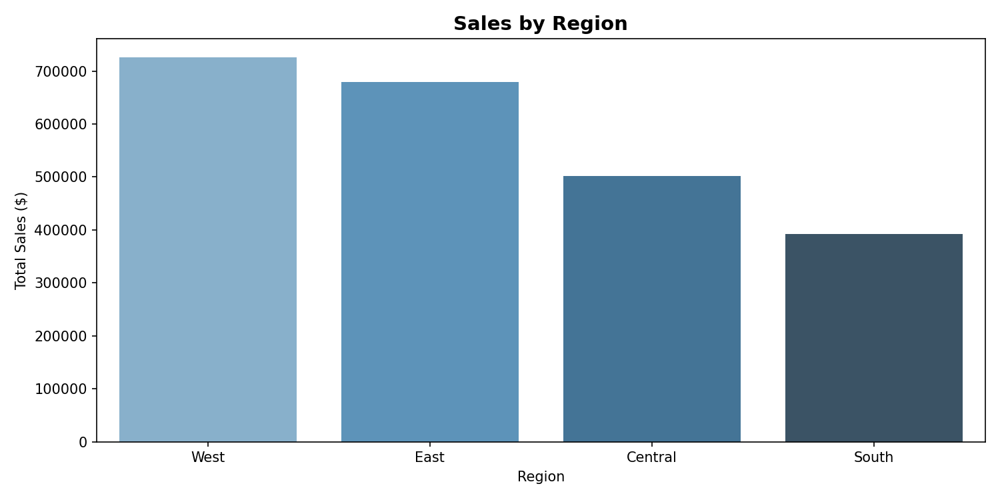
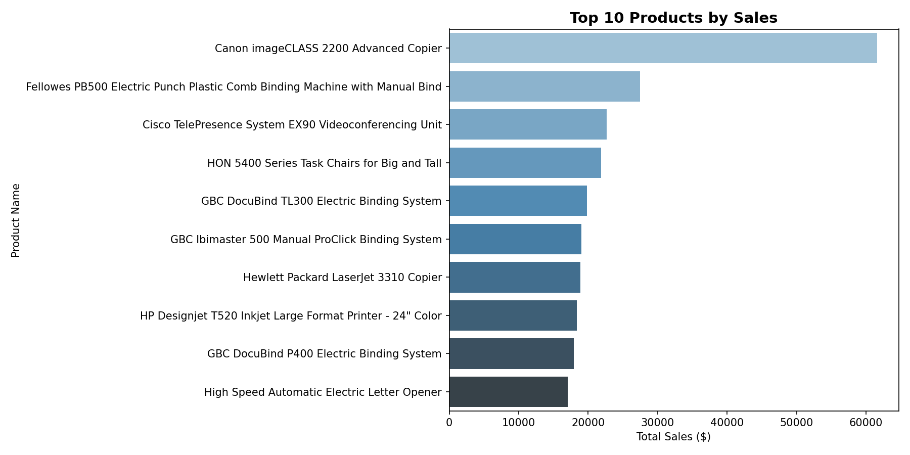

# Financial Performance & Revenue Analytics

Analyzing 4 years of Superstore sales data to uncover revenue drivers, profit trends, and customer insights using Python, SQL and Tableau.


## Dashboard Preview

<table>
  <tr>
    <td><b>Tableau — Full Dashboard</b><br>
    </td>
  </tr>
  <tr>
    <td><b>Sales Trend</b><br>
    </td>
    <td><b>Category Performance</b><br>
    </td>
  </tr>
  <tr>
    <td><b>Python — Sales by Region</b><br>
    </td>
    <td><b>Python — Top 10 Products</b><br>
    </td>
  </tr>
</table>


## Key Results

| Metric | Result |
|--------|--------|
| Total Revenue | $2.30M |
| Total Profit | $286K |
| Profit Margin | 12.47% |
| Total Orders | 9,994 |
| Top Region | West ($725K) |
| Top Category | Technology ($836K) |
| Best Customer Segment | Consumer (50.6%) |


## Tools & Technologies

| Tool | Purpose |
|------|---------|
| Python | Data cleaning, EDA, visualization |
| Pandas | Data manipulation |
| SQL (SQLite) | Revenue and segment queries |
| Tableau Public | Interactive dashboard |
| Matplotlib & Seaborn | Python charts |
| Google Colab | Development environment |
| GitHub | Version control |


## Why I Built This

Every business needs to understand where revenue comes from and where profit is being lost. This project explores 4 years of retail sales data
to identify top performing products, regions and customer segments the kind of analysis that directly supports strategic decision making in finance and operations roles.


## Key Findings

**Technology Drives the Most Revenue**
Technology was the highest revenue category at $836K, also delivering the best profit margins. Furniture had high sales but very low profit.

**West Region Leads Sales**
The West region consistently outperformed all other regions with $725K in total sales across 4 years.

**Consumer Segment Dominates**
The Consumer segment accounted for 50.6% of all sales, making it the most important customer group to retain and grow.

**Sales Growing Year on Year**
Revenue grew consistently from 2014 to 2017 with the strongest growth in Q4 each year driven by seasonal demand.

**Some Products Losing Money**
Several products in the Furniture category showed negative profit margins, representing an opportunity to reprice or discontinue.


## Project Structure
```
financial-performance-analytics/
├── superstore.csv                    # Original dataset
├── superstore_cleaned.csv            # Cleaned dataset
├── revenue_by_region.csv             # SQL query output
├── yearly_performance.csv            # SQL query output
├── financial_analysis.ipynb          # Python notebook
├── tableau_financial_dashboard.png   # Tableau dashboard
├── sales_trend.png                   # Python chart
├── category_performance.png          # Python chart
├── sales_by_region.png               # Python chart
├── sales_by_segment.png              # Python chart
├── top10_products.png                # Python chart
└── loss_products.png                 # Python chart
```


## How to Run

1. Open `financial_analysis.ipynb` in Google Colab
2. Upload `superstore.csv` when prompted
3. Run all cells in order
4. View interactive dashboard on Tableau Public


## Data Source

Superstore Sales Dataset via Kaggle.
Originally created by Tableau for training purposes.

⭐ Feel free to star this repository if you found it useful!
```
